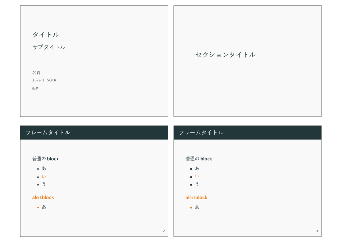

プレゼンテーションの際にPowerPointではハンドアウトとして1枚の紙に4枚や6枚などのスライドを印刷したものを配ることが多い．
BeamerなどLaTeXでスライドを作成している場合も，そういったPowerPointのようなハンドアウトもできればLaTeXで作りたい．
そういう時の解決法．

[pdfpages](https://ctan.org/pkg/pdfpages)パッケージを使ってスライドのPDF（下記のコードでは`main.pdf`）を読み込んで配置する．

```tex
\documentclass[dvipdfmx,uplatex,a4j,landscape]{jsarticle}
  \usepackage[top=12.7truemm,bottom=12.7truemm,left=12.7truemm,right=12.7truemm,landscape]{geometry}
    \usepackage{pdfpages}
    \begin{document}
    \includepdf[pages=-,nup=2x2,frame,noautoscale,delta=5mm 8mm]{main.pdf} %横に2x2の4枚
\end{document}
```

こんな感じのLaTeX文書を書くと

{{}}

こんな感じのハンドアウトができる．

簡単に解説すると，`\includepdf`の`nup`オプションで並べる枚数（ここでは2x2の4枚）を指定し，`frame`オプションで枠を付け，`noautoscale`および`delta`オプションで各スライド間の余白を作っている．