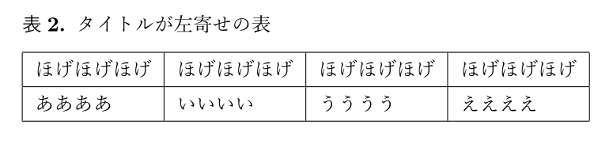

LaTeXの表（table環境）でキャプションを左寄せにするなど，カスタマイズする方法について．

<!--more-->

具体的には



こういう表を

{{}}

こんな感じにしたい．
（例としてキャプションを左寄せ，「表2」を太字にしてその後にピリオドを付加）

## 解決法

[threeparttable]( https://ctan.org/pkg/threeparttable )パッケージと
[caption](https://gitlab.com/axelsommerfeldt/caption)パッケージを使用する．
どちらもTeXLiveにはデフォルトで入ってるはず．

```tex
\documentclass[uplatex,a4j]{jsarticle}

\usepackage{threeparttable}
\usepackage{caption}
\captionsetup[table]{labelsep=period, labelfont=bf, justification=raggedright, singlelinecheck=off}


\begin{document}

\begin{table}[ht]
    \centering
    \begin{threeparttable} 
        \caption{キャプションが左寄せの表}
        \begin{tabular}{|l|l|l|l|}
            \hline
            ほげほげほげ & ほげほげほげ & ほげほげほげ & ほげほげほげ \\ \hline
            ああああ & いいいい & うううう & ええええ \\ \hline
        \end{tabular}
    \end{threeparttable} 
\end{table}

\end{document}
```

こんな感じ．

キャブションをカスタマイズするには

```tex
\captionsetup[table]{labelsep=period, labelfont=bf, justification=raggedright, singlelinecheck=off}
```

の部分をいじれば良い．簡単に解説すると

- `labelsep`:  
「表n」部分とそれ以降のテキスト部分の間を何で区切るか．`period`(ピリオド)以外にも`space`(スペース)，`colon`(コロン)，`newline`(改行)などがある．
- `labelfont`:   
「表n」部分のフォントをどうするか．`bf`(太字)以外にも斜体にしたりフォントサイズを変えたり色々できる．テキスト部分も一緒に変えたい場合は`font`を，テキスト部分のみ変えたい場合は`textfont`を使う．
- `justification`:  
キャプションをどこに寄せるか．ややこしいようだが`raggedright`で左，`centering`で中央，`raggedleft`で右に寄せられる．
- `singlelinecheck`:  
LaTeXのドキュメントクラスはキャプションが1行の場合，自動的に中央に寄せるようになる．それを`off`でオフにする．上記の`justification`を使用する場合，ほとんどの場合で必須．

このほかにもマージンのカスタマイズなど，様々なオプションが用意されているので，詳しくは[公式ドキュメント(PDF)](https://gitlab.com/axelsommerfeldt/caption/blob/3.3/doc/caption-eng.pdf)を参照して欲しい．


<iframe style="width:120px;height:240px;" marginwidth="0" marginheight="0" scrolling="no" frameborder="0" src="//rcm-fe.amazon-adsystem.com/e/cm?lt1=_blank&bc1=000000&IS2=1&bg1=FFFFFF&fc1=000000&lc1=0000FF&t=h1g0-22&language=ja_JP&o=9&p=8&l=as4&m=amazon&f=ifr&ref=as_ss_li_til&asins=4774187054&linkId=efe733c7964ae7f22fff62c9ccefc29e"></iframe>
