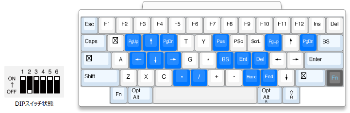

1ヶ月ほど前に[Happy Hacking Keyboard (HHKB) Professional HYBRID Type-S](https://www.pfu.fujitsu.com/direct/hhkb/detail_pd-kb800ws.html)を買った。
なので買った経緯とか1ヶ月使った感想とか現在のキーマッピングとかをメモしていきたい。

<!--more-->

## 購入に至る経緯

自分は今まで仕事ではHHKB Professional2 Type-Sを、
自宅では[Majestouch MINILA Air](https://www.diatec.co.jp/products/det.php?prod_c=1471)を使っていた。

そんな中、昨今のリモートワークの流れで、自分も自宅で仕事をせざるを得なくなった。
そこで「いつもやっている仕事は、やはりHHKBでやりたい」ということで、自宅にHHKBを持ち帰った。

ところが、自宅は職場よりも机が狭く、キーボードとコーヒーを近接して置かざるを得なかった。
案の定、リモートワークを初めて1週間経たないうちにHHKBにコーヒーをこぼしてしまった。
表面上の被害は軽微だったように見えたため、軽く拭き取ってそのままにしていたのだが、しばらくするとHHKBが誤作動[^1]するようになってしまった。

[^1]:特定のキーが常に押されっぱなしになるなど

慌てて中の基板を確かめたところ、基板までコーヒーが浸水してしまっており、
どうやらそれが原因で基板が駄目になってしまったようだった。

調べたところ、HHKBは[公式では修理を行っていない](https://faq.pfu.jp/faq/show/3106?category_id=166&site_domain=hhkb)らしい。
エンジニアの自分にとってキーボードは商売道具と言っても過言ではないため相当ヘコんだが、
去年の12月にHHKBの新シリーズ「HYBRID」が発売されていたことを知っていたため、そちらの購入を決意した[^2]。

[^2]:なお、新しいHHKBを注文したあとで、コーヒーをこぼしてしまった基板をダメ元でウェットティッシュ（アルコール）で丹念に拭いてしばらく乾かしてみたところ、何もごともなかったかのように復活した。したがって（今後リモートワークが解除されたら）職場と家の両方でHHKBを使うことができるようになった。嬉しい誤算である。

購入した理由としては以下の通りである。

- HHKBの打鍵感は他のキーボードの追随を許さない唯一無二のものであると考えていること。
- HYBRIDはキーマッピングのカスタマイズができる点がウリの1つであったこと

## 1ヶ月ほど使用してみた感想

打鍵感はほぼ期待通りであった。旧HHKB（自分が持っているProfessional2 Type-S）と比較すると、やや打鍵感が異なるように思え、若干疲れやすくなった気がしないでもない。
しかし、それでも他のキーボードよりも優れているとは思う。

Bluetooth接続は問題なく機能している。最大4台の接続情報を記憶しておき、`Fn + Ctrl + 1～4` キーで接続を切り替えられるのも便利である。

キーマッピングに関してはかなり期待していたのだが、やや期待はずれであった（後述）。

## キーマッピング

現在の自分の `Fn` レイヤーのキーマッピングはこんな感じである。通常レイヤーは変更点は無い。

{{}}

概要としては

- 左手のホームポジション周辺 `E`, `S`, `D`, `F` キーにそれぞれカーソルキーを配置。これはMajestouch MINILAがこの設定であり、右端にあるHHKBよりも便利だからである。
- HHKB本来のカーソルキーもよく使用するため、そのまま残した。
- カーソルキーの右上と左上には `PgUp`, `PgDn` キーを配置。これは自分が好きなThinkPadシリーズのキー配列がこうなっており、便利だからである。
- 右手のホームポジション周辺 `H`, `J`, `K`にそれぞれ`BS`,`Ent`,`Del`キーを配置。よく使うキーにも関わらず、ホームポジションから遠い位置にあるのが気に入らなかったためである。

こんな感じ。

### キーマッピングの問題点

右`Fn`キー、`Control`キー、`Q`キーなど、一部のキーはキーマッピングを設定できない。
これらの設定を変更できないキーはソフトウェア上で「☒」アイコンになっているが、それ以外にも`Z` キーなど、
**一見すると設定変更可能であるように見えるキーの中に、なぜか設定変更できないキーが存在**する。

これらのキーについて、公式では

>※特別な機能を割り当てられた一部のキーを除く。

と記述があるのみであり、 **「具体的にどのキーの設定が変更できないのか」** が明示されていない。

これは「自分の理想とするキーマッピングを実現できるのか否か」によって購入するかを判断するユーザにとっては大きな関心事であり、
その点の情報が公式から公開されていない、というのは問題であるように思われる。

## 今後の希望

少なくとも、「具体的にどのキーの設定が変更できないのか」を予め公式サイトでアナウンスしてほしい。
理想論としては、今後のファームウェアアップデートなどで、全てのキーを設定変更可能にしてほしい。

後は完全な妄言ではあるが、
Majestouch MINILAの「親指ダブルFnキー」はHHKBには無い優れたキー配置であると思っている。
HHKBも、それかそれに近いキー配置の製品を発売してほしい。

もっとも、親指ダブルFnキーはFILCOの公式サイトで

>【意匠権取得済み】

とアピールしており、他の会社が追従するのは（権利上）難しいのかもしれない。

サードパーティや同人で改造キットを出してくれる所があれば嬉しいなあ……。